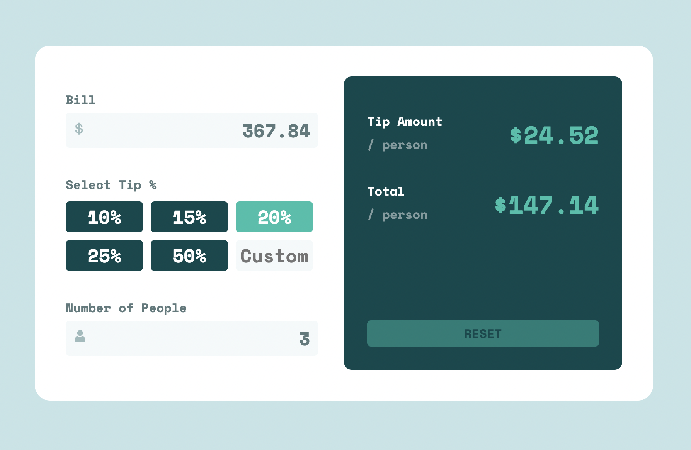

# Frontend Mentor - Tip calculator app solution

This is a solution to the [Tip calculator app challenge on Frontend Mentor](https://www.frontendmentor.io/challenges/tip-calculator-app-ugJNGbJUX). Frontend Mentor challenges help you improve your coding skills by building realistic projects.

## Table of contents

- [Overview](#overview)
  - [The challenge](#the-challenge)
  - [Screenshot](#screenshot)
  - [Links](#links)
- [My process](#my-process)
  - [Built with](#built-with)
  - [What I learned](#what-i-learned)

## Overview

### The challenge

Users should be able to:

- View the optimal layout for the app depending on their device's screen size
- See hover states for all interactive elements on the page
- Calculate the correct tip and total cost of the bill per person

### Screenshot



### Links

- Solution URL: [Add solution URL here](https://github.com/msalvatore22/Tip-Calculator)
- Live Site URL: [Add live site URL here](https://msalvatore22.github.io/Tip-Calculator/)

### Built with

- Vite
- Zustand
- CSS custom properties
- Flexbox
- [React](https://reactjs.org/) - JS library

### What I learned

Learned how to implement Zustand state management within a React application.

```js
const useStore = create((set) => ({
  bill: 0,
  tipPercent: 0,
  customTipPercent: '',
  people: 1,
  tipPerPerson: 0,
  totalPerPerson: 0,
  updateBill: (bill) => set(() => ({bill: bill})),
  updateTipPercent: (tipPercent) => set(() => ({tipPercent: tipPercent, customTipPercent: ''})),
  updateCustomTipPercent: (customTipPercent) => set(() => ({customTipPercent: customTipPercent, tipPercent: 0})),
  updatePeople: (people) => set(() => ({people: people})),
  updateTipPerPerson: () => set((state) => ({tipPerPerson: calculateTipPerPerson(state.bill, state.tipPercent, state.customTipPercent, state.people)})),
  updateTotalPerPerson: () => set((state) => ({totalPerPerson: calculateTotalPerPerson(state.bill, state.tipPerPerson, state.people)})),
  reset: () => set({ bill: 0, tipPercent: 0, people: 1, tipPerPerson: 0, totalPerPerson: 0 })
}))
```
